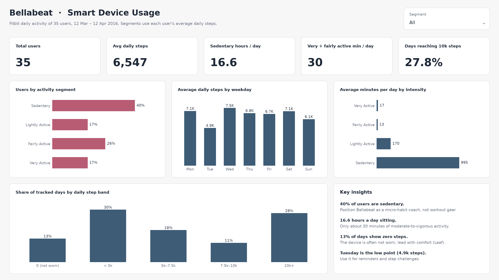

# Bellabeat Smart Device Usage Analysis

How do people use their fitness trackers, and what should Bellabeat's marketing team do about it?
This case study analyses Fitbit activity data from 35 users to find usage patterns and turns them into three marketing recommendations.



**Tools:** SQL (SQLite) · Power BI (DAX, Power Query) · Tableau Public · PowerPoint

## Key insights

| | Finding | What it means for Bellabeat |
|---|---|---|
| 1 | **40% of users are sedentary** (< 5,000 steps a day on average). Users sit 16.6 hours a day and get only about 30 minutes of moderate-to-vigorous activity. | The biggest segment is desk-bound people, not athletes. |
| 2 | **Activity peaks at 12:00 and 17:00–19:00**, around lunch and the commute home. | Timing of ads and notifications matters. |
| 3 | **Tracking drops at night and on some days.** Only 23 of 35 users logged sleep, and 13% of tracked days show zero steps. | Comfort and wearability limit how much data users collect. |

## Recommendations

1. **Sell micro-habits, not workouts.** Position products such as the *Spring* bottle as simple daily-habit tools (hydration, short walks).
2. **Schedule campaigns before activity peaks.** Concentrate digital ad budget and push notifications around 11:30 and 17:30.
3. **Lead with comfort for sleep tracking.** Promote the *Leaf* as a light clip-on that can be worn overnight.

## Dashboards

- **Power BI:** [`powerbi/Bellabeat.pbip`](powerbi/) — one-page overview with KPIs, user segments, weekday pattern, activity intensity and step bands. See the [Power BI guide](docs/powerbi-guide.md) to open it.
- **Tableau Public:** [interactive dashboard](https://public.tableau.com/views/Bellabeat_Smart_Device_Analysis_17875472877500/Dashboard2) with the hourly activity curve ([snapshot](images/dashboard_tableau.png)).

## Repository structure

```
├── data/            dailyActivity_merged.csv (Fitbit daily activity, 457 user-days)
├── sql/             SQLite queries for cleaning checks, segmentation and aggregates
├── powerbi/         Power BI Project (semantic model in TMDL, report in PBIR, theme)
├── docs/            Power BI guide: data model, DAX measures, layout
├── images/          dashboard previews
└── presentation/    executive deck (PDF and PPTX)
```

## Data

[FitBit Fitness Tracker Data](https://www.kaggle.com/datasets/arashnic/fitbit) (Möbius, CC0), Fitabase export for 12 March – 12 April 2016.
This repository includes the daily activity table; the hourly steps and sleep tables used for insights 2 and 3 come from the same dataset.

**Limitations:** small sample (35 users), one month of data, no demographic information, and the users are not necessarily Bellabeat's target customers. Findings are directional.

## Method

Follows the Google Data Analytics case-study flow: **Ask** (business task) → **Prepare** (source and credibility) → **Process** (type casting, duplicate and zero-step checks in SQL) → **Analyse** (segmentation, weekday and intensity patterns) → **Share** (Tableau, Power BI) → **Act** (recommendations and deck).
